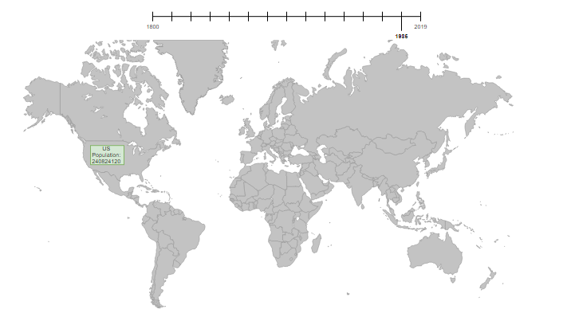

# No-Face: Wei Wen Zhou, Puneet Johal, Vincent Lin, Stefan Tan

## Description of Dataset
We would be using a dataset of population of countries from 1800 to 2100. By representing this data, we could easily study the demographics and the ongoing trend of human population in each country. This is the [dataset](https://docs.google.com/spreadsheets/d/18Ep3s1S0cvlT1ovQG9KdipLEoQ1Ktz5LtTTQpDcWbX0/edit?fbclid=IwAR2jyskV6_9ngphh320K3Q0MtmshKmaupYqNLCYaBI4gf2LMHA1T1x1u8u8#gid=1863690772) we would be using.

## Explanation of How to Make the Data Come Alive
There would be diagrams that are labeled of each country. Users could click on a diagram to enlarge it and show the population of the country. Users would also be able to change the year through the use of a slider. Users would be able to find out the trend of human population and would be left wondering the causes of the trend.

## Explanation of D3 Features
Our project would be similar to [this](https://bl.ocks.org/mbostock/2206590). We will have the enlargening feature when a user clicks on a country to display information on that country. When the user changes the year by using the slider the data will updated and show the population compared to the previous or next years. Users would be able to return to the map of the countries and look at the data for another country by clicking on it.  

## Sketch


## LAUNCH CODES
1. Open a terminal session.
2. Create your own environment by typing (name is a placeholder for the name of the virtual environment of your choosing):
```
$ python3 -m venv name
```
3. Activate the virtual environment by typing ```$ . name/bin/activate``` in the terminal and make sure it is running python3 by typing ```(venv)$ python --version``` in the terminal.
4. Clone this repository. If you have already cloned this repository, skip this step. To clone this repo, open a terminal session and navigate to the directory you want for this repository to located in. Then clone using SSH by typing ```(venv)$ git@github.com:wzhou2/No-Face.git``` or clone using HTTPS by typing ```(venv)$ git clone https://github.com/wzhou2/No-Face.git``` in the terminal.
5. Navigate to our repository by typing ```$ cd No-Face/``` in the terminal.
6. Run the python file by typing ```(venv)$ python app.py``` in the terminal. This should appear in the terminal after running the python file.   
```
* Running on http://127.0.0.1:5000/ (Press CTRL+C to quit)
* Restarting with stat
* Debugger is active!
* Debugger PIN: 248-748-502
```
7. Open a web browser and navigate to the link http://127.0.0.1:5000/.
